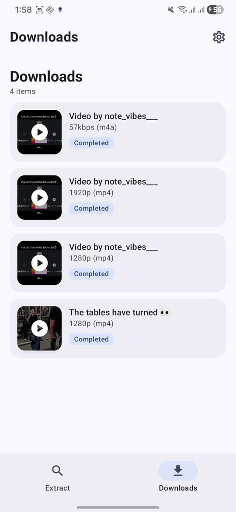
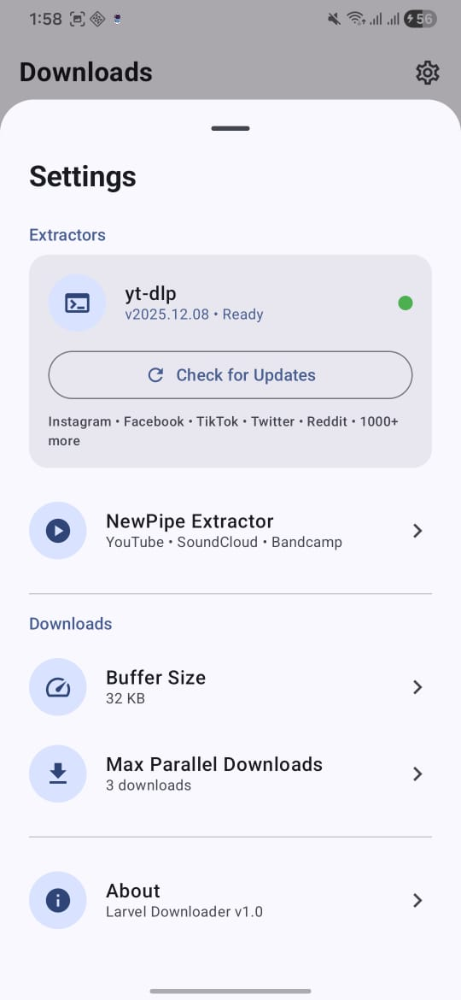
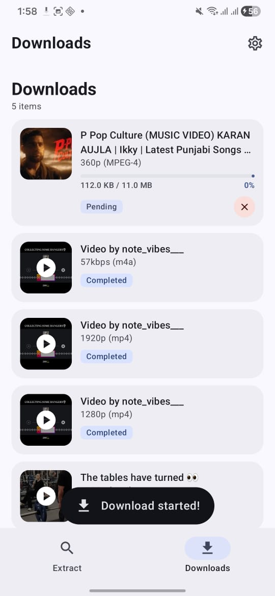

<p align="center">
  
  
  
  
</p>

<h1 align="center">
  <br>
  
  <br>
  Larvel Downloader
  <br>
</h1>

<h4 align="center">A powerful, modern Android video downloader supporting 1000+ websites</h4>

<p align="center">
  <a href="#key-features">Key Features</a> •
  <a href="#supported-platforms">Supported Platforms</a> •
  <a href="#screenshots">Screenshots</a> •
  <a href="#installation">Installation</a> •
  <a href="#tech-stack">Tech Stack</a> •
  <a href="#credits">Credits</a> •
  <a href="#license">License</a>
</p>

<p align="center">
  
  
  
  
</p>

---

## ✨ Key Features

- 🌐 **1000+ Websites** - Download from YouTube, Instagram, TikTok, Twitter/X, Facebook, Reddit, and many more
- 🎬 **Multiple Formats** - Choose from various video qualities (4K, 1080p, 720p, etc.) and audio formats
- 📱 **Modern UI** - Beautiful Material 3 design with dynamic theming
- ⚡ **Fast Downloads** - Multi-threaded downloads with resume support
- 📂 **Organized Storage** - Downloads saved to `Downloads/LarvelDownloader`
- 🔔 **Notifications** - Real-time download progress with completion alerts
- 🎵 **Audio Extraction** - Download audio-only streams from videos
- 🌙 **Dark Mode** - Full dark theme support

## 🌍 Supported Platforms

<table>
<tr>
<td>

### Social Media
- Instagram
- Facebook
- TikTok
- Twitter/X
- Reddit
- Pinterest
- Snapchat
- LinkedIn
- Tumblr

</td>
<td>

### Video Platforms
- YouTube
- Vimeo
- Dailymotion
- Twitch
- Bilibili
- Rumble
- BitChute
- Odysee
- VK

</td>
<td>

### Music & Audio
- SoundCloud
- Bandcamp
- Mixcloud
- Audiomack

</td>
<td>

### And More...
- TED
- CNN
- BBC
- Archive.org
- Streamable
- Imgur
- **1000+ sites!**

</td>
</tr>
</table>

## 📸 Screenshots

<p align="center">
  
  
  
  
</p>

## 📥 Installation

### Download APK
[](https://github.com/Binary0023/Larvel-Downloader/releases/latest)

### Build from Source

```bash
# Clone the repository
git clone https://github.com/Binary0023/Larvel-Downloader.git

# Navigate to project directory
cd larvel-downloader

# Build debug APK
./gradlew assembleDebug

# APK will be at: app/build/outputs/apk/debug/app-debug.apk
```

### Requirements
- Android 7.0 (API 24) or higher
- Internet connection

## 🛠️ Tech Stack

| Technology | Purpose |
|------------|---------|
| **Kotlin** | Primary programming language |
| **Jetpack Compose** | Modern declarative UI toolkit |
| **Material 3** | Design system with dynamic colors |
| **Room Database** | Local storage for download history |
| **Coroutines & Flow** | Asynchronous programming |
| **OkHttp** | HTTP client for downloads |
| **Coil** | Image loading library |

## 🏗️ Architecture

```
app/
├── data/           # Database, DAOs, DataStore
├── download/       # Download manager & service
├── extractor/      # Video extraction logic
├── model/          # Data classes
└── ui/             # Compose UI components
```

## 🙏 Credits

This project wouldn't be possible without these amazing open-source projects:

<table>
<tr>
<td align="center">
<a href="https://github.com/TeamNewPipe/NewPipeExtractor">

<br/>
<b>NewPipe Extractor</b>
</a>
<br/>
<sub>YouTube extraction</sub>
</td>
<td align="center">
<a href="https://github.com/yt-dlp/yt-dlp">

<br/>
<b>yt-dlp</b>
</a>
<br/>
<sub>1000+ site support</sub>
</td>
<td align="center">
<a href="https://github.com/JunkFood02/youtubedl-android">

<br/>
<b>youtubedl-android</b>
</a>
<br/>
<sub>Android yt-dlp wrapper</sub>
</td>
</tr>
</table>

## ⚠️ Disclaimer

This application is intended for downloading content that you have the right to download. Please respect copyright laws and the terms of service of the platforms you use. The developers are not responsible for any misuse of this application.

## 📄 License

```
MIT License

Copyright (c) 2024 Your Name

Permission is hereby granted, free of charge, to any person obtaining a copy
of this software and associated documentation files (the "Software"), to deal
in the Software without restriction, including without limitation the rights
to use, copy, modify, merge, publish, distribute, sublicense, and/or sell
copies of the Software, and to permit persons to whom the Software is
furnished to do so, subject to the following conditions:

The above copyright notice and this permission notice shall be included in all
copies or substantial portions of the Software.

THE SOFTWARE IS PROVIDED "AS IS", WITHOUT WARRANTY OF ANY KIND, EXPRESS OR
IMPLIED, INCLUDING BUT NOT LIMITED TO THE WARRANTIES OF MERCHANTABILITY,
FITNESS FOR A PARTICULAR PURPOSE AND NONINFRINGEMENT. IN NO EVENT SHALL THE
AUTHORS OR COPYRIGHT HOLDERS BE LIABLE FOR ANY CLAIM, DAMAGES OR OTHER
LIABILITY, WHETHER IN AN ACTION OF CONTRACT, TORT OR OTHERWISE, ARISING FROM,
OUT OF OR IN CONNECTION WITH THE SOFTWARE OR THE USE OR OTHER DEALINGS IN THE
SOFTWARE.
```

---

<p align="center">
  Made with ❤️ using Kotlin & Jetpack Compose
</p>

<p align="center">
  <a href="https://github.com/Binary0023/Larvel-Downloader/issues">Report Bug</a>
  •
  <a href="https://github.com/Binary0023/Larvel-Downloader/issues">Request Feature</a>
</p>
